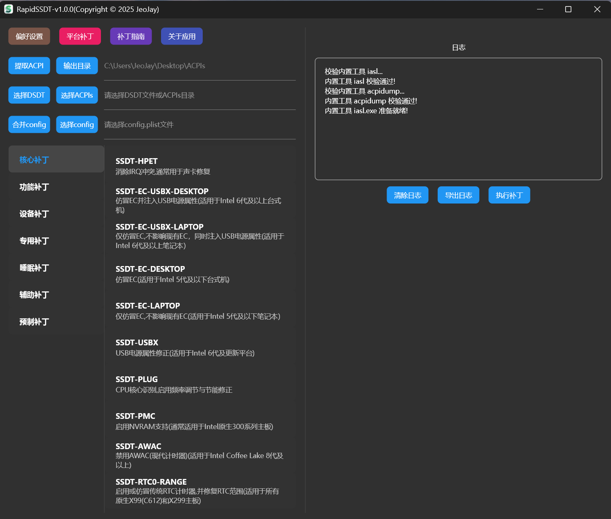
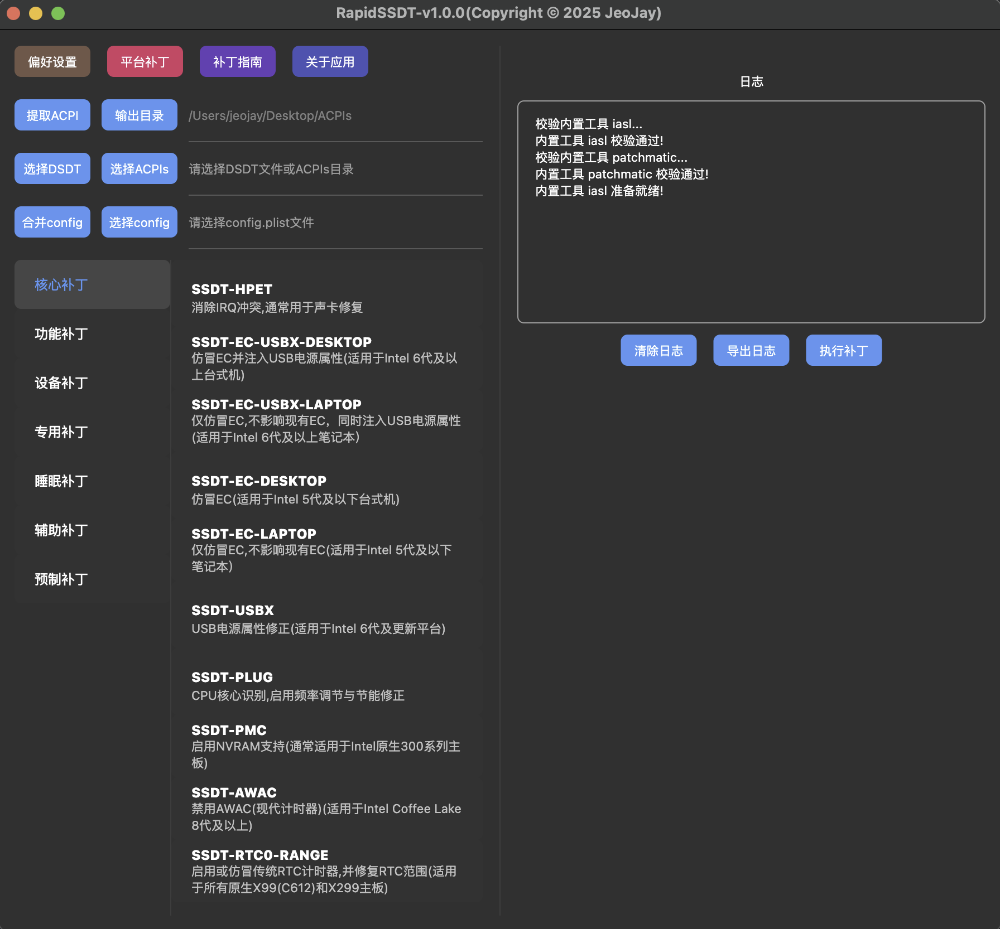
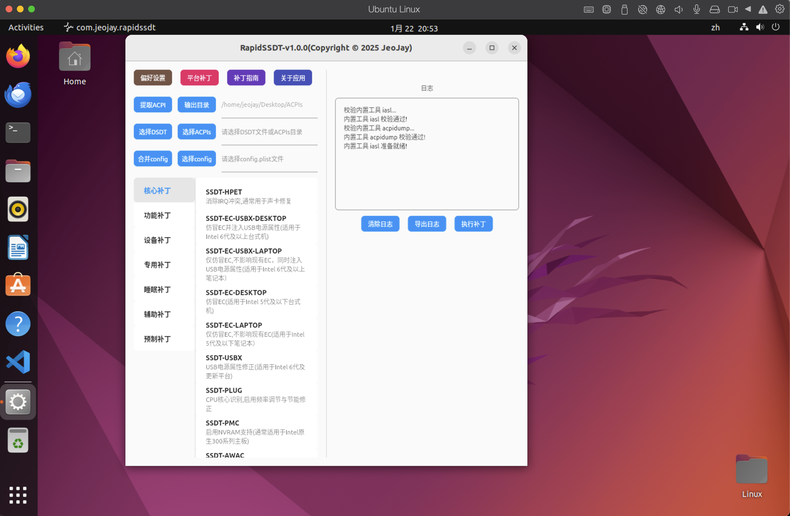
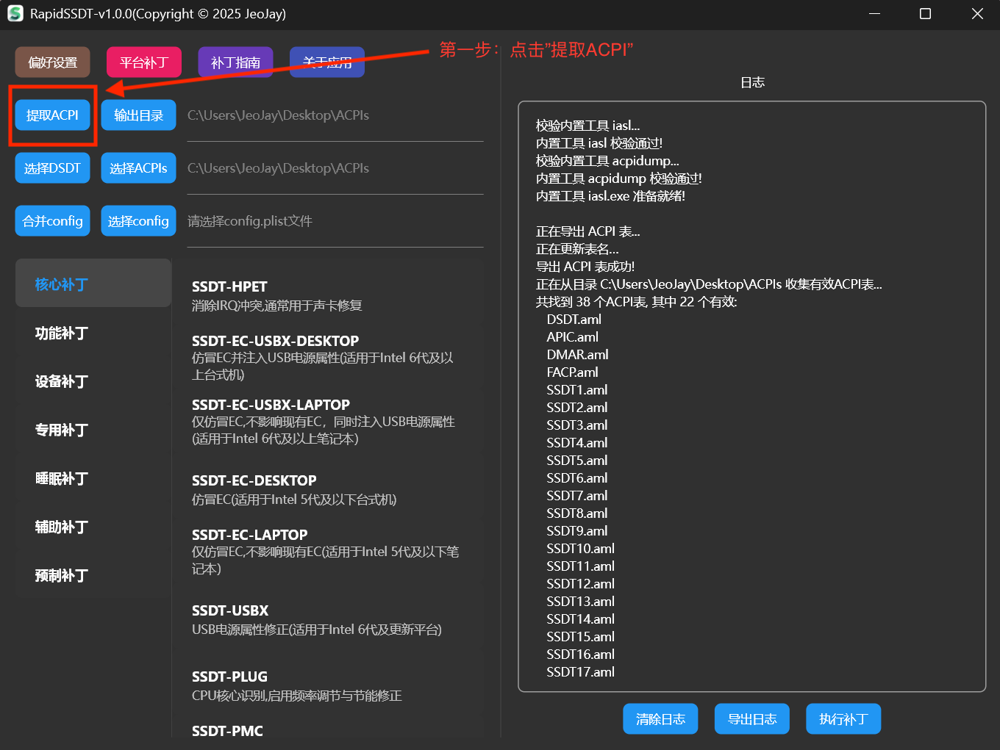
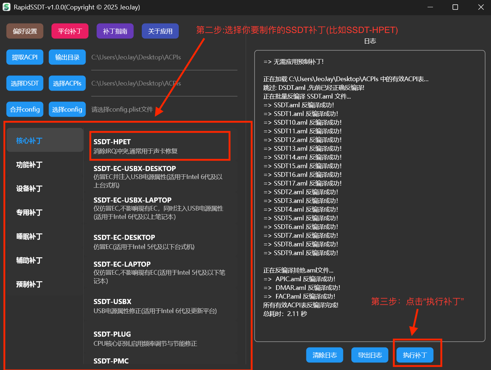
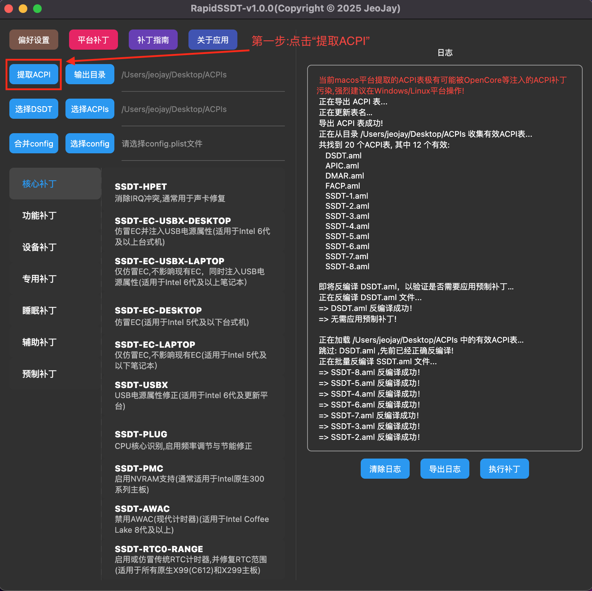

## 目录

- [项目初衷](#项目初衷)
- [1.RapidSSDT简介](#1RapidSSDT简介)
- [2.RapidSSDT软件预览](#2RapidSSDT软件预览)
- [3.RapidSSDT特点](#3RapidSSDT特点)
- [4.RapidSSDT系统兼容性](#4RapidSSDT系统兼容性)
- [5.支持SSDTs](#5支持SSDTs)
- [6.提取ACPI](#6提取ACPI)
- [7.工具使用指南](#7工具使用指南)
- [8.致谢](#8致谢)

## 项目初衷

在传统 Hackintosh 配置过程中：

- SSDT / DSDT 补丁编写门槛高
- 需要频繁查阅 ACPI 规范、示例仓库和论坛帖子
- 手工修改 ASL，容易出错且难以维护
- 新手往往不知道「哪些补丁是必须的，哪些是可选的」

RapidSSDT 的目标是：**把“零散的 ACPI 经验”和“重复的补丁工作”，整合为可视化、结构化、可复用的流程。**

## 1.RapidSSDT简介

**RapidSSDT** 是一个使用 **Flutter** 开发的开源跨平台图形化工具（支持 **Windows / macOS / Linux**），

旨在**简化黑苹果（Hackintosh）环境下 SSDT / DSDT 补丁的生成与定制**，降低 ACPI 定制门槛。

**工具详细指南请参考 [RapidSSDT 详细指南](wiki/SSDT-补丁指南.md)**

## 2.RapidSSDT软件预览

Windows版本:

macOS版本:

Linux版本:

## 3.RapidSSDT特点

- 🚀 **开箱即用**

  - 无需复杂环境配置

  - 下载后即可直接运行

    

- 🧩 **补丁模块化**

  - 常见 SSDT 功能按模块分类
  
  - 按平台分类列出对应平台所需SSDT,可一键获取所有SSDT及补丁

    

- 📄 **自动化生成**

  - 根据用户选择生成对应的 SSDT / DSDT 补丁
  
  - 减少手工编辑 ASL 的需求

  - 降低语法错误和逻辑错误风险
  
    
  
- 🖥 **跨平台一致体验**

  - 使用 Flutter 开发

  - 在 Windows、macOS、Linux 上提供一致的界面和操作逻辑

## 4.RapidSSDT系统兼容性

- Windows: 仅支持 Windows 10及以上 (不支持 Windows 8、7及更早版本).建议彻底关闭360，腾讯电脑管家，火绒等安全软件,以免操作过程中被拦截.

- macOS: 仅支持 macOS 10.15及以上,且显卡需支持 Metal (不建议macOS提取ACPI,请使用Windows或者Linux提取).注意在系统设置中【安全与隐私】- 【安全性】允许安装任何来源的软件

- Linux: 支持Debian 10及以上, Ubuntu 20.04 LTS ~  24.04 LTS (不支持20.04之前的老版本，24.10及以上版本)

## 5.支持SSDTs

 •  **SSDT-HPET**

   • 消除IRQ冲突,通常用于声卡修复

 •  **SSDT-EC-USBX-DESKTOP**

   • 仿冒EC并注入USB电源属性(适用于Intel 6代及以上台式机)

 •  **SSDT-EC-USBX-LAPTOP**

   • 仅仿冒EC,不影响现有EC，同时注入USB电源属性（适用于Intel 6代及以上笔记本）

 •  **SSDT-EC-DESKTOP**

   • 仿冒EC(适用于Intel 5代及以下台式机)

 •  **SSDT-EC-LAPTOP**

   • 仅仿冒EC,不影响现有EC（适用于Intel 5代及以下笔记本）

 •  **SSDT-USBX**

   • USB电源属性修正(适用于Intel 6代及更新平台)

 •  **SSDT-PLUG**

   • CPU核心识别,启用频率调节与节能修正

 •  **SSDT-PLUG-ALT**

  • 修复电源管理(适用于Intel 12代及以上，部分AMD Ryzen等平台)

 •  **SSDT-PMC**

   • 添加缺失的PMCR设备,启用NVRAM支持(通常适用于Intel原生300系列主板)

 •  **SSDT-PNLF**

   • 添加PNLF设备以提供背光支持(仅适用于笔记本和一体机)

 •  **SSDT-ALS0**

   • 提供屏幕背光调节所需的传感器支持(仅适用于笔记本和一体机)

 •  **SSDT-XOSI**

   • macOS伪装成Windows,解锁被屏蔽的设备(如I2C触摸板)

 •  **SSDT-RHUB**

   • USB端口重置与修正

 •  **SSDT-Bridge**

   • 为缺失的 PCI 设备路径创建桥接

 •  **SSDT-DMAR**

   • 移除DMAR保留内存区域,修复系统启动问题,网卡兼容性问题

 •  **SSDT-SBUS-MCHC**

   • 添加系统总线SMBus支持,定义SMBus兼容性的MCHC和BUS0设备

 •  **SSDT-IMEI**

   • 修复IMEI问题(通常适用于Ivy Bridge和 Sandy Bridge 核显加速修复)

 •  **SSDT-FixShutdown**

   • 修复关机变重启或关机不断电问题

 •  **SSDT-GPRW**

   • 修复由于USB控制器导致睡眠即醒问题

 •  **SSDT-UPRW**

   • 修复由于USB控制器导致睡眠即醒问题

 •  **SSDT-LID**

   • 修复睡眠按键睡眠问题(适用于笔记本)

 •  **SSDT-LED**

   • 修复唤醒后电源键呼吸灯异常问题(适用于联想笔记本)

 •  **SSDT-S3-DISABLE**

   • 禁用系统 S3 睡眠状态(修复S3睡眠唤醒崩溃,重启或关机问题)

 •  **SSDT-WakeScreen**

   • 修复唤醒后需按任意键亮屏问题  

 •  **SSDT-FACP**

   • 热重启修改为冷重启，修复部分平台从Windows重启到macOS后,导致部分硬件不可用的问题。(比如：声卡,WiFi,蓝牙)

 •  **SSDT-GPU-SPOOF**

   • AMD 显卡仿冒,通过修改 macOS 读取的设备 ID，让 macOS 误以为该显卡是支持的型号，从而启用加速功能。(RX 550 Lexa 核心, RX 6650XT, RX 6950XT等)

 •  **SSDT-PCI-DISABLE**

   • 屏蔽PCI设备,包括不支持的显卡、NVMe固态硬盘,WiFi等

 •  **SSDT-RMNE**

   • 仿冒有线网卡设备(适用于没有有线网卡的笔记本)

 •  **SSDT-GPI0**

  • 修复笔记本I2C触摸板问题(适用于笔记本)

 •  **SSDT-CPUR**

  • B850,B650,B550,A520等芯片组的CPU重命名,修复AMD平台无法识别CPU导致的崩溃问题

 •  **SSDT-AWAC**

  • 禁用AWAC时钟(现代计时器)(适用于Intel Coffee Lake 8代及以上)

 •  **SSDT-UNC**

  •	所有原生X99(C612)主板和大多数原生X79(C602)主板需要

 •	**SSDT-RTC0-RANGE**

  •	启用或仿冒传统RTC计时器,并修复RTC范围(适用于所有原生X99(C612)和X299主板)

 •	**SSDT-DMAC**

  •	仿冒一个标准DMA控制器（添加缺失的部件,这只是一种完善方案,非必要!）

 •	**SSDT-PWRB**

  •	仿冒一个标准PWRB控制器（添加缺失的部件,这只是一种完善方案,非必要!）

 •	**SSDT-SLPB**

  •	仿冒一个标准SLPB控制器（添加缺失的部件,这只是一种完善方案,非必要!）

 •	**SSDT-MEM2**

  •	仿冒一个IGPU所需的MEM2设备（添加缺失的部件,这只是一种完善方案,非必要!）

## 6.提取ACPI

##### **注意事项:** 

如果更改了以下任何一项，您必须重新提取、重新补丁，因为这些更改可能会导致本机ACPI（特别是SystemMemory区域）发生重大更改：

- 更新BIOS

- 更改任何BIOS选项

- 更改硬件或内存配置

##### 使用Windows提取(推荐)

  - 确保使用原生Boot Manager 方式来启动Windows，如果你使用了三方引导，比如：OpenCore来引导进入Windows系统，那么提取的ACPI表几乎已经被OpenCore注入的ACPI补丁污染，并非原始ACPI表！

  **Win下打开RapidSSDT,找到可执行文件rapidssdt.exe,双击运行,点击【提取ACPI】按钮,即可提取本机的SSDT与DSDT.**

  

  **Win下提取完成后,默认输出在Desktop桌面ACPIs文件夹, 同时【选择ACPIs】路径这一块,会自动选择该文件夹，后续补丁操作都将基于该文件夹.无需手动选择！！！**

  

##### 使用Linux提取(可选)  

 - 已经安装好Linux的情况下,可以使用Linux来提取ACPI表.一般不建议专门安装Linux来提取ACPI表

  **Linux下点击【提取ACPI】按钮，输入sudo密码后,即可提取本机的SSDT与DSDT.**

  

  

##### 使用macOS提取(不推荐)  

 - 不建议在macOS上提取ACPI表,因为绝大多数启动场景下,macOS都已经被OpenCore等引导器注入了ACPI补丁,提取的ACPI表几乎已经被污染,并非原始ACPI表!

 - 如果已经安装了macOS，并且目前没有使用任何补丁的ACPI文件启动，那么可以在Mac系统提取ACPI,否则不建议在Mac系统提取ACPI.

 **macOS下点击【提取ACPI】按钮,即可提取本机的SSDT与DSDT.请注意,提取的ACPI表几乎已经被污染,并非原始ACPI表!**
 
 

## 7.工具使用指南

**工具详细指南请参考 [RapidSSDT 详细指南](wiki/SSDT-补丁指南.md)**

## 8.致谢:

   - [CorpNewt](https://github.com/CorpNewt) 相关ACPI补丁指南与示例

   - [Rehabman](https://github.com/RehabMan) 相关ACPI补丁以及iasl等工具
   
   - [acidanthera](https://github.com/acidanthera) 相关ACPI补丁指南与示例

   - [dortania](https://github.com/dortania) 相关ACPI补丁指南与示例 